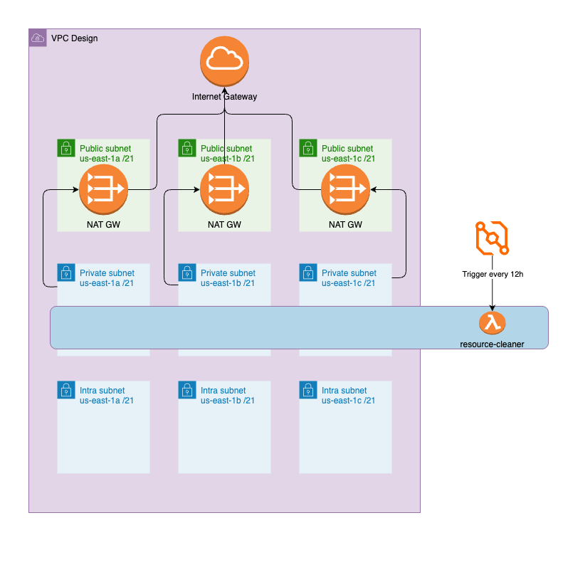

# VPC-Enabled Lambda for Automated EC2 Snapshot Deletion

Create an AWS Lambda via terraform that runs in a VPC private subnet and automatically deletes EC2 snapshots older than one year, with proper IAM permissions, logging, and scheduling via CloudWatch/EventBridge. The Lambda code should list, filter, and delete snapshots while handling errors gracefully.



IaC tool was used is terraform as it works with most cloud providers.
Terraform code in this repo contains code to create VPC, lambda, Deploy lambda and all required resources

Assumptions made: 
 -  resource region: us-east-1
 -  Lambda logs/metrics are in CloudWatch
 -  Lambda will Run every 12h
 -  State is stored locally (No remote backend is configured)
 -  [Env var is set to run in dry mode](https://github.com/rpuserh/aws-lambda-app/blob/main/workspace/lambda.tf#L111)

To run this workspace via terraform update file `env.sh` by updating creds and source file
```
source ./env.sh
cd workspace
terraform init
terraform plan
terraform apply
```

[VPC resources:](https://github.com/rpuserh/aws-lambda-app/blob/main/workspace/vpc.tf)
 - 3 public subnets and one route table to reoute traffic via Internet GW
 - 3 Nat Gateways In each region per Public subnet
 - 3 Private Subnets and 3 route traffic to internet via NAT gateway (Per each region)
 - 3 intra Subnets. This is true Private Subnets there is no internet access. (Not used but have recomindation see below)

[Lambda resources:]((https://github.com/rpuserh/aws-lambda-app/blob/main/workspace/lambda.tf))
 - Lambda roles to access VPC, EC2 snapshots and write logs to cloudwatch
 - Lambda function with VPC integration
 - Lambda function deployment
 - cloudwatch event rule and trigger to run lambda on schedule
   See file for each resource description


### Recommendations for Improvement
For enhanced security, the Lambda function could be moved to the intra subnets. This would prevent it from having any outbound internet access. To allow the function to communicate with the AWS EC2 API, we would need to create a VPC Endpoint for EC2 within these subnets.

List of terraform resources raw
```
data.archive_file.lambda_zip
aws_cloudwatch_event_rule.every_12_hours
aws_cloudwatch_event_target.lambda_target
aws_iam_policy.lambda_policy
aws_iam_role.lambda_exec_role
aws_iam_role_policy_attachment.lambda_policy_attach
aws_lambda_function.resource_cleaner
aws_lambda_permission.allow_cloudwatch
aws_security_group.lambda_sg
module.vpc.aws_default_network_acl.this[0]
module.vpc.aws_default_route_table.default[0]
module.vpc.aws_default_security_group.this[0]
module.vpc.aws_eip.nat[0]
module.vpc.aws_eip.nat[1]
module.vpc.aws_eip.nat[2]
module.vpc.aws_internet_gateway.this[0]
module.vpc.aws_nat_gateway.this[0]
module.vpc.aws_nat_gateway.this[1]
module.vpc.aws_nat_gateway.this[2]
module.vpc.aws_route.private_nat_gateway[0]
module.vpc.aws_route.private_nat_gateway[1]
module.vpc.aws_route.private_nat_gateway[2]
module.vpc.aws_route.public_internet_gateway[0]
module.vpc.aws_route_table.intra[0]
module.vpc.aws_route_table.private[0]
module.vpc.aws_route_table.private[1]
module.vpc.aws_route_table.private[2]
module.vpc.aws_route_table.public[0]
module.vpc.aws_route_table_association.intra[0]
module.vpc.aws_route_table_association.intra[1]
module.vpc.aws_route_table_association.intra[2]
module.vpc.aws_route_table_association.private[0]
module.vpc.aws_route_table_association.private[1]
module.vpc.aws_route_table_association.private[2]
module.vpc.aws_route_table_association.public[0]
module.vpc.aws_route_table_association.public[1]
module.vpc.aws_route_table_association.public[2]
module.vpc.aws_subnet.intra[0]
module.vpc.aws_subnet.intra[1]
module.vpc.aws_subnet.intra[2]
module.vpc.aws_subnet.private[0]
module.vpc.aws_subnet.private[1]
module.vpc.aws_subnet.private[2]
module.vpc.aws_subnet.public[0]
module.vpc.aws_subnet.public[1]
module.vpc.aws_subnet.public[2]
module.vpc.aws_vpc.this[0]
```


